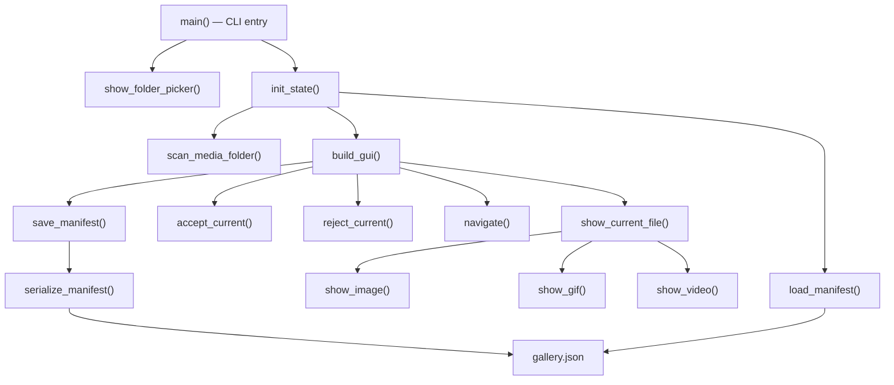

# Design Document: Gallery Sorter GUI

## Overview

The Gallery Sorter GUI is a standalone single-file Python script (~500 lines) that replaces the manual process of editing `gallery.json` files by hand. It lets the user visually browse media files (images and videos) in a specific subfolder under `frontend/public/media/`, accept or reject each file, write descriptions, and output a `gallery.json` manifest.

The tool lives in `tools/gallery-sorter/` at the project root.

### Key Design Decisions

- **Single script, procedural style**: Everything lives in `gallery_sorter.py`. No classes, no OOP. State is held in plain dicts and lists, passed between functions or stored in module-level variables scoped to the tkinter root via a simple state dict.
- **Python + tkinter**: Ships with Python, no GUI framework install needed. Cross-platform.
- **Pillow for images**: Required for loading `.jpg`, `.png`, `.webp` into tkinter. Also handles animated `.gif` frame extraction.
- **OpenCV (cv2) for video playback**: Provides frame-by-frame video decoding for `.mp4` and `.webm` files. Frames are rendered into the tkinter canvas at ~24fps using `after()` scheduling. This avoids heavy dependencies like VLC bindings while giving real playback.
- **Animated GIF support via Pillow**: `.gif` files are displayed as animations by iterating through frames using Pillow's `ImageSequence`, rendered at the GIF's native frame rate.
- **Project-root-relative path resolution**: The tool finds `frontend/public/media/` by walking up from its own location (two levels up from `tools/gallery-sorter/`).

## Architecture



The application is a flat set of functions. A single `state` dict holds all mutable application state (current index, file list, per-file statuses/descriptions, tkinter widget references, playback handles). Functions read from and write to this dict. No classes, no inheritance, no method dispatch.

## Application State

All mutable state lives in a single dict, initialized by `init_state()`:

```python
state = {
    "folder_path": Path,              # Absolute path to the selected media folder
    "files": ["filename.jpg", ...],   # Sorted list of media filenames
    "statuses": {"filename.jpg": "undecided" | "accepted" | "rejected", ...},
    "descriptions": {"filename.jpg": "caption text", ...},
    "current_index": 0,               # Index into files list
    "playback_id": None,              # after() callback ID for gif/video playback
    "video_capture": None,            # cv2.VideoCapture handle (or None)
    # tkinter widget references (set by build_gui):
    "root": None,
    "canvas": None,
    "desc_entry": None,
    "status_label": None,
    "progress_label": None,
    "filename_label": None,
    "accept_btn": None,
    "reject_btn": None,
    "prev_btn": None,
    "next_btn": None,
    "save_btn": None,
}
```

## Functions

### CLI & Setup

```python
def main():
    """
    Entry point. Parses sys.argv for optional folder name.
    Resolves project root, validates folder, launches GUI.
    """

def resolve_media_root() -> Path:
    """Walk two levels up from script location to find frontend/public/media/."""

def show_folder_picker(media_root: Path) -> str | None:
    """Show a tkinter Listbox dialog of available media subfolders. Returns folder name or None."""
```

### Scanning & Manifest I/O

```python
SUPPORTED_EXTENSIONS = {".jpg", ".jpeg", ".png", ".webp", ".gif", ".mp4", ".webm"}
IMAGE_EXTENSIONS = {".jpg", ".jpeg", ".png", ".webp"}
VIDEO_EXTENSIONS = {".mp4", ".webm"}

def scan_media_folder(folder_path: Path) -> list[str]:
    """Return sorted list of supported media filenames. Case-insensitive extension match."""

def load_manifest(manifest_path: Path) -> list[dict]:
    """Load gallery.json, return list of {"file": ..., "description": ...} dicts. Empty list if missing."""

def serialize_manifest(entries: list[dict]) -> str:
    """Serialize list of {"file", "description"} dicts to JSON string with 2-space indent + trailing newline."""

def save_manifest_to_disk(entries: list[dict], manifest_path: Path) -> None:
    """Write serialized manifest to disk."""

def deserialize_manifest(json_string: str) -> list[dict]:
    """Parse JSON string into list of {"file", "description"} dicts."""
```

### State Initialization

```python
def init_state(folder_path: Path, files: list[str], existing_manifest: list[dict]) -> dict:
    """
    Build the state dict. Files in the manifest are marked "accepted" with descriptions.
    Files on disk but not in manifest are marked "undecided" (not pre-rejected, so user still reviews them).
    Manifest entries referencing missing files are discarded with a console warning.
    """

def init_file_states(files: list[str], manifest: list[dict]) -> tuple[dict, dict]:
    """
    Returns (statuses_dict, descriptions_dict).
    Files in manifest → "accepted" + description from manifest.
    Files not in manifest → "undecided" + empty description.
    Stale manifest entries (file not on disk) → warning printed, skipped.
    """
```

### GUI Construction

```python
def build_gui(state: dict) -> None:
    """
    Create the tkinter window and all widgets. Store widget references in state dict.
    Layout:
    - Top: filename label + progress label
    - Center: canvas for media display (resizable)
    - Bottom-left: description entry (text field)
    - Bottom-right: Accept / Reject / Prev / Next / Save buttons
    - Footer: keyboard shortcut hints
    Bind keyboard shortcuts.
    """

def bind_shortcuts(state: dict) -> None:
    """Bind keyboard shortcuts to the root window."""
```

### Media Display

```python
def show_current_file(state: dict) -> None:
    """
    Stop any active playback, then route to show_image/show_gif/show_video
    based on the current file's extension. Update UI labels and button states.
    """

def show_image(state: dict, filepath: Path) -> None:
    """Load image with Pillow, scale to fit canvas, display as PhotoImage."""

def show_gif(state: dict, filepath: Path) -> None:
    """
    Load GIF with Pillow, extract frames via ImageSequence.
    Animate by scheduling frame updates with root.after().
    Loop back to first frame at end.
    """

def show_video(state: dict, filepath: Path) -> None:
    """
    Open with cv2.VideoCapture. Read native FPS (default 24).
    Decode frames one at a time, convert BGR→RGB→PIL.Image→PhotoImage.
    Schedule next frame with root.after(). Include play/pause via Space key.
    """

def stop_playback(state: dict) -> None:
    """Cancel pending after() callback. Release VideoCapture if open."""
```

### Actions

```python
def navigate(state: dict, direction: int) -> None:
    """
    Move current_index by direction (+1 or -1).
    Clamp to [0, len(files)-1]. Save description before moving.
    Call show_current_file().
    """

def accept_current(state: dict) -> None:
    """Mark current file as 'accepted', save description, advance to next file."""

def reject_current(state: dict) -> None:
    """Mark current file as 'rejected', advance to next file."""

def save_manifest(state: dict) -> None:
    """
    Collect accepted files in file-list order, build manifest entries,
    prompt for overwrite confirmation if gallery.json exists, write to disk.
    """
```

### UI Helpers

```python
def update_ui(state: dict) -> None:
    """
    Refresh all UI elements: progress label, filename label, status indicator color,
    description field contents, button enabled/disabled states.
    """

def format_progress(index: int, total: int) -> str:
    """Return '{index+1} / {total}' string."""

def save_current_description(state: dict) -> None:
    """Read description entry widget text and store in state['descriptions'] for current file."""

def get_status_color(status: str) -> str:
    """Return a hex color: green for accepted, red for rejected, grey for undecided."""
```

### Video Playback Strategy

For `.mp4` and `.webm` files:
1. Open the video with `cv2.VideoCapture`.
2. Read the native FPS from the file metadata (default to 24 if unavailable).
3. Decode frames one at a time, convert BGR→RGB, create a `PIL.Image`, then a `tkinter.PhotoImage`.
4. Schedule the next frame using `root.after(delay_ms, next_frame_callback)`.
5. Space key toggles play/pause by cancelling or resuming the `after()` loop.
6. On file navigation, `stop_playback()` releases the `VideoCapture` and cancels pending callbacks.

For `.gif` files:
1. Open with `PIL.Image.open()` and extract all frames via `PIL.ImageSequence.Iterator`.
2. Read frame duration from GIF metadata (default to 100ms).
3. Display each frame as a `tkinter.PhotoImage` using `after()` scheduling.
4. Loop back to the first frame when the sequence ends.

### Keyboard Shortcuts

| Key | Action |
|-----|--------|
| `a` | Accept current file |
| `r` | Reject current file |
| `→` (Right arrow) | Next file |
| `←` (Left arrow) | Previous file |
| `Ctrl+S` | Save manifest |
| `Space` | Play/pause video (when viewing a video) |

### Folder Selection Dialog

When no folder argument is provided, `show_folder_picker()` creates a small tkinter `Toplevel` with a `Listbox` populated with subdirectory names from `frontend/public/media/`. The user selects one and clicks "Open" (or double-clicks). Returns the folder name string.

## Data Models

### gallery.json Schema

```json
[
  { "file": "IMG_001.jpg", "description": "Caption text here" },
  { "file": "demo.mp4", "description": "" }
]
```

| Field | Type | Required | Description |
|-------|------|----------|-------------|
| `file` | string | yes | Filename (not a path) of the media file |
| `description` | string | yes | One-line caption. Empty string if no caption. |

All internal data uses plain dicts with `"file"` and `"description"` keys — no dataclasses, no named tuples.

### File Structure

```
tools/gallery-sorter/
├── gallery_sorter.py    # Single script — everything lives here (~500 lines)
├── requirements.txt     # Pillow, opencv-python-headless
└── README.md            # Full documentation
```

## Correctness Properties

### Property 1: Serialization round-trip

*For any* valid list of manifest entry dicts, serializing to JSON and then deserializing should produce an equivalent list.

**Validates: Requirements 9.1, 6.1**

### Property 2: Media scanner returns only supported files

*For any* directory containing a mix of files with supported and unsupported extensions, `scan_media_folder` should return exactly the files whose extensions (case-insensitive) are in the supported set, and no others.

**Validates: Requirements 1.5**

### Property 3: Non-existent folder produces error

*For any* folder name string that does not correspond to an existing subdirectory under the media root, the folder validation should raise an error.

**Validates: Requirements 1.4**

### Property 4: Navigation changes index correctly

*For any* list of media files and any valid current index, navigating forward (when not at the last file) should increment the index by 1, and navigating backward (when not at the first file) should decrement the index by 1. Navigating forward at the last index or backward at index 0 should leave the index unchanged.

**Validates: Requirements 2.6, 2.7, 2.8, 2.9**

### Property 5: Accept and reject set correct status and advance

*For any* media file at any valid index, accepting it should set its status to `"accepted"` and advance to the next file, and rejecting it should set its status to `"rejected"` and advance to the next file. Re-accepting or re-rejecting a previously decided file should overwrite the previous status.

**Validates: Requirements 3.3, 3.4, 3.6**

### Property 6: Progress indicator formatting

*For any* current index `i` (0-based) and total file count `n` (where `n > 0` and `0 <= i < n`), the progress string should equal `"{i+1} / {n}"`.

**Validates: Requirements 2.5**

### Property 7: Manifest contains exactly accepted files in file-list order

*For any* list of media files with a mix of accepted and rejected statuses, building the manifest should include only the accepted files, and their order should match their position in the original file list.

**Validates: Requirements 5.4, 5.5**

### Property 8: Serialized manifest format

*For any* non-empty list of manifest entry dicts, the serialized JSON string should use 2-space indentation and end with a trailing newline. Each element should have exactly the keys `"file"` and `"description"`.

**Validates: Requirements 5.3, 5.6**

### Property 9: Manifest loading initializes file states correctly

*For any* set of on-disk filenames and any valid manifest (subset of those filenames with descriptions), `init_file_states` should mark files present in the manifest as `"accepted"` with their descriptions, and mark files not in the manifest as `"undecided"`.

**Validates: Requirements 6.2, 6.3, 6.4**

### Property 10: Stale manifest entries are discarded

*For any* manifest containing entries that reference filenames not present in the on-disk file set, `init_file_states` should discard those entries and only return states for files that actually exist on disk.

**Validates: Requirements 6.5**

### Property 11: Description persistence across navigation

*For any* accepted file with a non-empty description, navigating away and back should preserve the description exactly as entered.

**Validates: Requirements 4.3**

## Error Handling

| Scenario | Behavior |
|----------|----------|
| Folder argument doesn't exist | Print error to stderr, exit with non-zero code |
| Folder contains no supported media files | Show info dialog, exit gracefully |
| `gallery.json` contains invalid JSON | Show error dialog, proceed with empty manifest |
| `gallery.json` entries reference missing files | Discard stale entries, print warning to console |
| `gallery.json` entry missing required keys | Skip malformed entry, print warning to console |
| Video file fails to open with OpenCV | Show error placeholder in display area, allow navigation |
| Image file fails to load with Pillow | Show error placeholder in display area, allow navigation |
| Save fails (permission error, disk full) | Show error dialog with OS error message, do not exit |
| Save with zero accepted files | Write empty JSON array `[]` (valid manifest) |

All non-fatal errors let the user keep working. Only missing folder / no media files are fatal at startup.

## Testing Strategy

### Dual Testing Approach

- **Unit tests**: Verify specific examples, edge cases, and error conditions.
- **Property tests**: Verify universal properties across randomly generated inputs using Hypothesis.

### Property-Based Testing Configuration

- **Library**: [Hypothesis](https://hypothesis.readthedocs.io/)
- **Minimum iterations**: 100 per property test (`@settings(max_examples=100)`)
- **Tag format**: `# Feature: gallery-sorter-gui, Property N: <name>`

### Test File Structure

Since the tool is a single script, tests import its functions directly:

```
tools/gallery-sorter/
├── gallery_sorter.py
├── requirements.txt
├── README.md
└── tests/
    ├── test_manifest.py      # Unit + property tests for serialization, loading, state init
    ├── test_scanner.py       # Unit + property tests for scan_media_folder
    └── test_navigation.py    # Unit + property tests for navigate, accept, reject, progress
```

### Running Tests

```bash
cd tools/gallery-sorter
pip install -r requirements.txt
pip install hypothesis pytest
pytest tests/ -v
```
