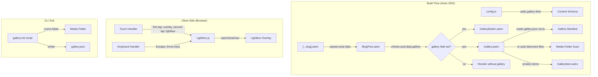

# Post Gallery — Design Document

## Overview

The Post Gallery feature adds an optional, author-curated media gallery as an appendix to blog posts. It integrates into the existing Astro 4.x static site by extending the content schema, the `BlogPost` layout, and introducing new Astro components for the gallery grid, lightbox viewer, and a Node.js CLI helper script.

All gallery logic runs at build time (Astro SSG) or client-side (lightbox interactions). No server runtime is required. Media files live in the existing `frontend/public/media/{folder-name}` directories and are served as static assets through CloudFront.

### Key Design Decisions

1. **CSS-only masonry layout** — Uses CSS `column-count` rather than a JS masonry library. This keeps the bundle zero-JS for the grid itself and aligns with the site's minimal philosophy.
2. **Vanilla JS for lightbox** — A small `<script>` tag in the gallery component handles lightbox open/close/navigation and keyboard traps. No framework dependency needed since Astro ships zero JS by default.
3. **Build-time manifest loading** — The `gallery.json` manifest is read via `fs` at build time inside the Astro component's frontmatter block. This avoids runtime fetch calls and keeps the page fully static.
4. **Progressive enhancement for touch** — On touch devices, the first tap reveals the description overlay; a second tap (or explicit button) opens the lightbox. This replaces hover which doesn't exist on mobile.

## Architecture



### Data Flow

1. **Build time**: `[...slug].astro` fetches the post → passes it to `BlogPost.astro` → if `post.data.gallery` is set, `BlogPost.astro` renders `GalleryButton` and `Gallery` components.
2. **Gallery component**: Reads `frontend/public/media/{gallery}/gallery.json` via Node.js `fs` in the Astro frontmatter block. If no manifest exists, it scans the directory for supported file extensions and sorts alphabetically.
3. **Client side**: The lightbox script attaches click handlers to gallery items. On click, it creates a full-viewport overlay with the media, description, close button, and prev/next navigation. Keyboard events (Escape, Arrow keys) and focus trapping are handled in the same script.
4. **CLI tool**: `npm run gallery:init -- {folder}` runs a Node.js script that scans `frontend/public/media/{folder}` for supported files, generates a `gallery.json` skeleton, and writes it to disk.

## Components and Interfaces

### New Files

| File | Type | Purpose |
|------|------|---------|
| `frontend/src/components/Gallery.astro` | Astro Component | Main gallery section with masonry grid, renders all gallery items |
| `frontend/src/components/GalleryButton.astro` | Astro Component | CTA button rendered after post content, scrolls to gallery |
| `frontend/src/components/GalleryItem.astro` | Astro Component | Single item in the grid (image or video) with hover overlay |
| `frontend/src/components/GalleryLightbox.astro` | Astro Component | Lightbox overlay markup + client-side `<script>` for interactions |
| `frontend/scripts/gallery-init.ts` | Node.js CLI Script | Generates `gallery.json` skeleton from a media folder |

### Modified Files

| File | Change |
|------|--------|
| `frontend/src/content/config.ts` | Add optional `gallery` field (string) to blog schema |
| `frontend/src/layouts/BlogPost.astro` | Import and conditionally render `GalleryButton` and `Gallery` components |
| `frontend/package.json` | Add `gallery:init` script entry |

### Component Interfaces

#### `Gallery.astro`

```typescript
interface Props {
  /** Name of the media folder under public/media/ */
  folder: string;
}
```

Build-time logic (frontmatter block):
- Reads `public/media/{folder}/gallery.json` if it exists
- Falls back to scanning the directory for supported extensions
- Produces a `GalleryItem[]` array passed to the template

#### `GalleryButton.astro`

```typescript
interface Props {
  /** Anchor ID of the gallery section to scroll to */
  targetId?: string; // defaults to "gallery"
}
```

Renders a full-width styled anchor link that smooth-scrolls to `#{targetId}`.

#### `GalleryItem.astro`

```typescript
interface Props {
  /** Path to the media file relative to site root, e.g. "/media/worldskills/photo.jpg" */
  src: string;
  /** Optional one-line description */
  description?: string;
  /** Media type: "image" or "video" */
  type: "image" | "video";
  /** Zero-based index for lightbox navigation */
  index: number;
}
```

#### `GalleryLightbox.astro`

No props — renders a hidden overlay container and a `<script>` tag. The script:
- Listens for `gallery:open` custom events dispatched by `GalleryItem` click handlers
- Manages open/close state, prev/next navigation, keyboard events, and focus trapping
- Populates the overlay with the clicked item's media and description

#### `gallery-init.ts` (CLI)

```
Usage: npm run gallery:init -- <folder-name>

Arguments:
  folder-name    Directory name under frontend/public/media/

Behavior:
  1. Resolves path to frontend/public/media/{folder-name}
  2. Validates folder exists (exit 1 if not)
  3. Checks for existing gallery.json (warn and exit 0 if found)
  4. Scans for supported files: .jpg, .jpeg, .png, .webp, .gif, .mp4, .webm
  5. Warns and exits if no supported files found
  6. Writes gallery.json with entries sorted alphabetically
  7. Prints summary: "{n} items added → {path}"
```

### Integration with BlogPost.astro

The `BlogPost.astro` layout is modified to conditionally render gallery components:

```astro
---
// existing imports...
import GalleryButton from "../components/GalleryButton.astro";
import Gallery from "../components/Gallery.astro";

const { post } = Astro.props;
const hasGallery = !!post.data.gallery;
---

<!-- existing post markup... -->

<div class="post-content">
  <slot />
</div>

{hasGallery && <GalleryButton />}

<footer class="post-footer">
  <!-- existing footer content -->
</footer>

{hasGallery && <Gallery folder={post.data.gallery} />}
```

The gallery button sits between the post content and footer. The gallery section itself renders after the footer, acting as an appendix.

## Data Models

### Gallery Manifest Schema (`gallery.json`)

```json
[
  {
    "file": "IMG_001.jpg",
    "description": "Soldering the main PCB"
  },
  {
    "file": "demo.mp4",
    "description": ""
  }
]
```

TypeScript type used at build time inside `Gallery.astro`:

```typescript
interface GalleryManifestEntry {
  /** Filename within the media folder */
  file: string;
  /** Optional one-line caption */
  description?: string;
}

type GalleryManifest = GalleryManifestEntry[];
```

### Resolved Gallery Item (internal)

After loading the manifest (or auto-discovering files), the `Gallery.astro` component produces:

```typescript
interface ResolvedGalleryItem {
  /** Full path from site root, e.g. "/media/worldskills/IMG_001.jpg" */
  src: string;
  /** Caption text, empty string if none */
  description: string;
  /** "image" or "video", derived from file extension */
  type: "image" | "video";
}
```

### Supported File Extensions

```typescript
const IMAGE_EXTENSIONS = [".jpg", ".jpeg", ".png", ".webp", ".gif"];
const VIDEO_EXTENSIONS = [".mp4", ".webm"];
const SUPPORTED_EXTENSIONS = [...IMAGE_EXTENSIONS, ...VIDEO_EXTENSIONS];
```

### Content Schema Extension

The existing Zod schema in `config.ts` gains one field:

```typescript
const blog = defineCollection({
  type: "content",
  schema: z.object({
    // ...existing fields...
    /**
     * Optional gallery folder name. When set, enables the gallery appendix.
     * Must match a directory name under frontend/public/media/.
     * Example: "worldskills"
     */
    gallery: z.string().min(1).optional(),
  }),
});
```

The `.min(1)` constraint satisfies Requirement 1.4 — when provided, the value must be a non-empty string.

## Correctness Properties

*A property is a characteristic or behavior that should hold true across all valid executions of a system — essentially, a formal statement about what the system should do. Properties serve as the bridge between human-readable specifications and machine-verifiable correctness guarantees.*

### Property 1: Gallery schema validation

*For any* input value provided as the `gallery` field in blog frontmatter, the Zod schema should accept it if and only if it is a non-empty string or undefined. Empty strings, numbers, booleans, and other non-string types should be rejected.

**Validates: Requirements 1.1, 1.4**

### Property 2: Conditional gallery rendering

*For any* blog post data object, the rendered output should contain gallery-related markup (gallery button and gallery section) if and only if the `gallery` field is a non-empty string. When `gallery` is omitted or undefined, no gallery markup should be present.

**Validates: Requirements 1.2, 1.3**

### Property 3: Manifest resolution preserves order and filters to listed files

*For any* valid gallery manifest (array of entries with `file` fields) and any set of files in a media folder, the resolved gallery items should contain exactly the files listed in the manifest, in the same order as the manifest, ignoring any files in the folder not listed in the manifest.

**Validates: Requirements 2.3, 2.4**

### Property 4: Auto-discovery fallback produces alphabetically sorted supported files

*For any* media folder without a `gallery.json` manifest, the resolved gallery items should contain exactly the files with supported extensions (`.jpg`, `.jpeg`, `.png`, `.webp`, `.gif`, `.mp4`, `.webm`), sorted alphabetically by filename. Files with unsupported extensions should be excluded.

**Validates: Requirements 2.5, 2.6, 2.7**

### Property 5: File type classification from extension

*For any* filename, the system should classify it as `"image"` if its extension is one of `.jpg`, `.jpeg`, `.png`, `.webp`, `.gif`, as `"video"` if its extension is `.mp4` or `.webm`, and as unsupported otherwise. The classification should be case-insensitive.

**Validates: Requirements 2.6, 2.7**

### Property 6: Correct HTML element per media type

*For any* resolved gallery item, if the item type is `"image"` the rendered HTML should contain an `` element with `loading="lazy"`, and if the item type is `"video"` the rendered HTML should contain a `<video>` element.

**Validates: Requirements 4.4, 4.5**

### Property 7: Alt text derivation

*For any* gallery image item, the rendered `` element should have an `alt` attribute equal to the item's description when the description is non-empty, or equal to the filename when the description is empty or absent.

**Validates: Requirements 7.3**
