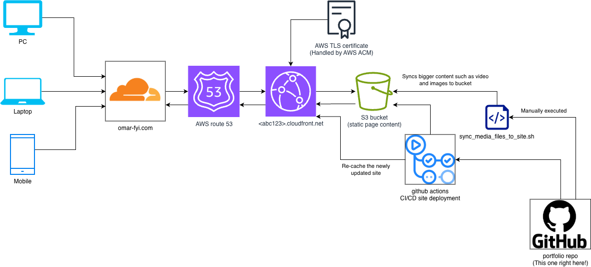

# Omar Maaouane Veiga — Portfolio & Blog

A minimal, fast, and cost-effective personal website built with Astro and hosted on AWS.

**Live:** [https://omar-fyi.com](https://omar-fyi.com)

## Architecture


**Flow:** Users hit `omar-fyi.com` → Route 53 resolves to CloudFront → CloudFront runs a URL rewrite function (appends `index.html` to directory paths) → serves cached content from S3 with TLS via ACM. GitHub Actions builds and deploys on every push to `main`.

## Tech Stack

| Layer          | Technology                              |
|----------------|-----------------------------------------|
| Frontend       | [Astro](https://astro.build) 4.x       |
| Hosting        | AWS S3 + CloudFront                     |
| DNS            | AWS Route 53                            |
| TLS            | AWS ACM (free, auto-renewing)           |
| Infrastructure | Terraform                               |
| CI/CD          | GitHub Actions                          |
| Domain         | Cloudflare Registrar (~£10/year)        |

## Prerequisites

- [Node.js](https://nodejs.org) >= 20
- [Terraform](https://www.terraform.io/downloads) >= 1.5
- [AWS CLI](https://aws.amazon.com/cli/) v2, configured with credentials
- Domain name (registered via [Cloudflare Registrar](https://www.cloudflare.com/products/registrar/))
- A GitHub account

## Project Structure

```
portfolio_site/
├── frontend/                    # Astro project
│   ├── src/
│   │   ├── content/
│   │   │   ├── blog/            # Markdown blog posts
│   │   │   └── config.ts        # Content collection schema
│   │   ├── layouts/
│   │   │   ├── BaseLayout.astro  # Site-wide layout
│   │   │   └── BlogPost.astro   # Blog post layout
│   │   └── pages/
│   │       ├── blog/
│   │       │   ├── index.astro  # Blog listing
│   │       │   └── [...slug].astro  # Dynamic post routes
│   │       ├── index.astro      # Homepage
│   │       ├── about.astro      # About page
│   │       ├── 404.astro        # Custom 404
│   │       └── robots.txt.ts    # Generated robots.txt
│   ├── public/
│   │   └── favicon.svg
│   ├── astro.config.mjs
│   ├── package.json
│   └── tsconfig.json
├── terraform/                   # Infrastructure as Code
│   ├── modules/
│   │   ├── s3/                  # S3 bucket + policy
│   │   ├── cloudfront/          # CDN distribution + OAC + URL rewrite function
│   │   ├── acm/                 # TLS certificate
│   │   └── route53/             # DNS records
│   ├── main.tf
│   ├── variables.tf
│   ├── outputs.tf
│   ├── backend.tf               # Remote state (commented)
│   └── terraform.tfvars.example
├── .github/workflows/
│   ├── deploy.yml               # Build + deploy to S3
│   └── terraform.yml            # Infrastructure CI/CD
├── .gitignore
└── README.md
```

## Domain Setup

The domain `omar-fyi.com` is registered through **Cloudflare Registrar** (~£10/year). Cloudflare only handles registration — DNS is managed by AWS Route 53.

**Setup:** After running `terraform apply`, copy the Route 53 nameservers from `terraform output name_servers` and set them as **custom nameservers** in Cloudflare Dashboard → Domain Registration → Manage Domain → Nameservers.

## Local Development

### Frontend

```bash
cd frontend

# Install dependencies
npm install

# Start dev server (http://localhost:4321)
npm run dev

# Build for production
npm run build

# Preview production build
npm run preview
```

### Writing Blog Posts

Use the scaffolding script to create a new post with all the frontmatter and imports pre-filled:

```bash
cd frontend
./new-post.sh
```

It will prompt you for:
- **Title** — also auto-generates a URL slug from it
- **Format** — `md` or `mdx` (mdx includes component imports for `MediaEmbed`, `LinkCard`, and `DownloadCard`)
- **Description** and optional **gallery folder**

The file is created in `src/content/blog/` with today's date as `pubDate`.

Alternatively, create a `.md` file manually in `frontend/src/content/blog/`:

```markdown
---
title: "Your Post Title"
description: "A brief description for listings and SEO."
pubDate: 2026-03-01
---

Your content here. Full Markdown support with syntax highlighting.
```

## Infrastructure Setup

### 1. Configure Terraform Variables

```bash
cd terraform
cp terraform.tfvars.example terraform.tfvars
# Edit terraform.tfvars with your domain name
```

### 2. Set Up Remote State (Optional but Recommended)

Follow the instructions in `backend.tf` to create an S3 bucket for state management. Then uncomment the backend configuration and run:

```bash
terraform init -migrate-state
```

### 3. Deploy Infrastructure

```bash
terraform init
terraform plan     # Review what will be created
terraform apply    # Create all resources
```

### 4. Update Domain Nameservers

After `terraform apply`, note the name servers from the output:

```bash
terraform output name_servers
```

In Cloudflare Dashboard: **Domain Registration → Manage Domain → Nameservers** → switch to custom nameservers and enter the 4 Route 53 nameservers. DNS propagation may take up to 48 hours (usually minutes).

### 5. Configure GitHub Secrets

In your GitHub repository, go to **Settings → Secrets and variables → Actions** and add:

| Secret                        | Value                              |
|-------------------------------|------------------------------------|
| `AWS_ACCESS_KEY_ID`           | Your AWS access key                |
| `AWS_SECRET_ACCESS_KEY`       | Your AWS secret key                |
| `AWS_REGION`                  | `eu-west-2`                        |
| `S3_BUCKET`                   | From `terraform output s3_bucket_name` |
| `CLOUDFRONT_DISTRIBUTION_ID`  | From `terraform output cloudfront_distribution_id` |

### 6. Deploy the Site

Push to `main` or trigger the workflow manually:

```bash
git add .
git commit -m "Initial deployment"
git push origin main
```

The GitHub Action will build the Astro site, sync it to S3, and invalidate the CloudFront cache. Your site should be live within ~90 seconds.


### 7. Sync local content to bucket media folder

Now you have a running website however you won't be able to upload much content to it since github has a limit of
500MB. In order to sync your content to the remote bucket just run:

```bash
chmod +x sync_media_files_to_site.sh
./sync_media_files_to_site.sh
```

And all your media content will be uploaded to the bucket. This goes for all the content located at `frontend/public/media`

## Deployment Workflow

### Automatic Deployment

- **Frontend changes** (`frontend/**`): Triggers the Build & Deploy workflow
- **Infrastructure changes** (`terraform/**`): Triggers the Terraform workflow

Both workflows also support manual triggers via `workflow_dispatch`.

### Manual Deployment

```bash
# Build
cd frontend && npm run build

# Deploy
aws s3 sync dist/ s3://YOUR_BUCKET --delete

# Invalidate cache
aws cloudfront create-invalidation \
  --distribution-id YOUR_DIST_ID \
  --paths "/*"
```

## Cost Estimate

| Service             | Cost                                              |
|---------------------|---------------------------------------------------|
| **Domain**          | ~£10/year (Cloudflare Registrar)                  |
| **S3**              | ~$0.023/GB/month storage — a few MB, essentially free |
| **CloudFront**      | 1 TB/month free for the first year, then ~$0.085/GB |
| **Route 53**        | $0.50/hosted zone/month + $0.40/million queries   |
| **ACM**             | Free (public certificates)                        |
| **CloudFront Function** | Free (under 2 million invocations/month)      |
| **Total**           | **~£10/year domain + ~$1–2/month AWS**            |

## Security

- **No public S3 access** — bucket is fully private, content served only through CloudFront via Origin Access Control (OAC)
- **HTTPS everywhere** — HTTP requests are automatically redirected to HTTPS
- **TLS 1.2+** — minimum protocol version enforced at CloudFront
- **Encryption at rest** — S3 bucket uses AES-256 server-side encryption
- **Versioning** — S3 versioning enabled for content protection
- **Least privilege** — CloudFront OAC grants read-only access to S3 objects
- **Infrastructure as Code** — all resources are defined, versioned, and auditable

## Post Gallery

Blog posts can include an optional photo/video gallery appendix. To enable it:

1. Add `gallery: "folder-name"` to the post's frontmatter, where `folder-name` matches a directory under `frontend/public/media/`.

   ```md
   ---
   title: "My Post"
   description: "A cool project"
   pubDate: 2025-06-01
   gallery: "my-project"
   ---

   Post content goes here...
   ```

   That's it — the "Behind the Scenes" navigation button and gallery section are automatically injected by the `BlogPost` layout. You don't need to add anything in the post body itself.

2. Scaffold a `gallery.json` manifest:

   ```bash
   cd frontend
   npm run gallery:init -- folder-name
   ```

   This scans the media folder and generates a `gallery.json` skeleton with all discovered images and videos.

3. Edit `gallery.json` to add descriptions and reorder items:

   ```json
   [
     { "file": "IMG_001.jpg", "description": "Soldering the main PCB" },
     { "file": "demo.mp4", "description": "" }
   ]
   ```

   Each entry has a required `file` (filename) and an optional `description` (one-line caption). Only files listed in the manifest are displayed, in the order specified. If no `gallery.json` exists, all supported media files are auto-discovered and sorted alphabetically.

Supported formats: `.jpg`, `.jpeg`, `.png`, `.webp`, `.gif`, `.mp4`, `.webm`.

## Gallery Sorter GUI

A graphical tool for building `gallery.json` manifests visually. Instead of guessing what each cryptically-named media file looks like, you can flip through images and videos in a tkinter GUI, accept or reject each one, and write descriptions as you go.

```bash
cd tools/gallery-sorter
pip install -r requirements.txt
python gallery_sorter.py [folder-name]
```

Run without a folder name to get a picker dialog. Keyboard shortcuts: `a` to accept, `r` to reject, arrow keys to navigate, `Ctrl+S` to save. Videos play inline with `Space` to pause.

For full documentation see [`tools/gallery-sorter/README.md`](tools/gallery-sorter/README.md).

## Hero Gallery Picker

A quick GUI for managing the photo gallery on the [About page](frontend/src/pages/about.astro). It reads the current gallery images from `about.astro`, lets you browse `public/media/` to add new ones, reorder or remove them, edit alt text, and writes the changes back to the file.

```bash
cd tools/hero-gallery-picker
pip install -r requirements.txt
python hero_gallery_picker.py
```

Select images via the file dialog, drag them into the order you want with Move Up / Move Down, fill in alt text, and hit "Save to about.astro".

## License

Content is © Omar Maaouane Veiga. Code is available for reference.
